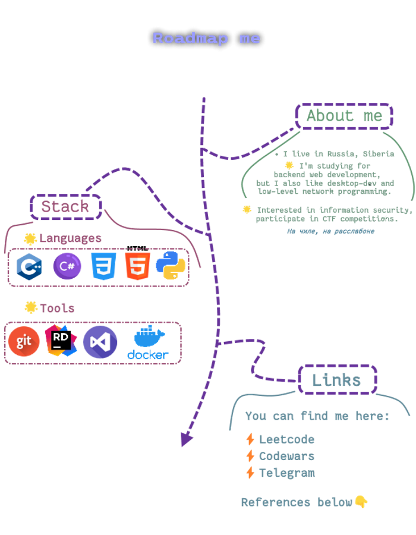

# 
Hola, amigo 👋 

 

  </img>

 

🔸 [**Leetcode profile (clickable)**](https://leetcode.com/blvckmarker)

🔸 [**Codewars profile (clickable)**](https://www.codewars.com/users/blvckmarker)

🔸 [**Telegram profile (clickable)**](https://t.me/blvckmarker)

### 
Some statistics ⚰

  
*
Most used languages
*
  

*
Active&pinned repos
*

  

 

